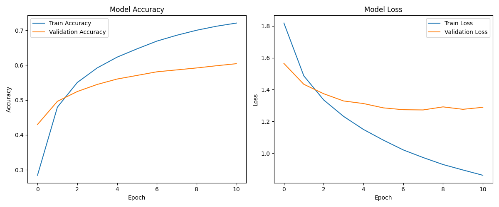
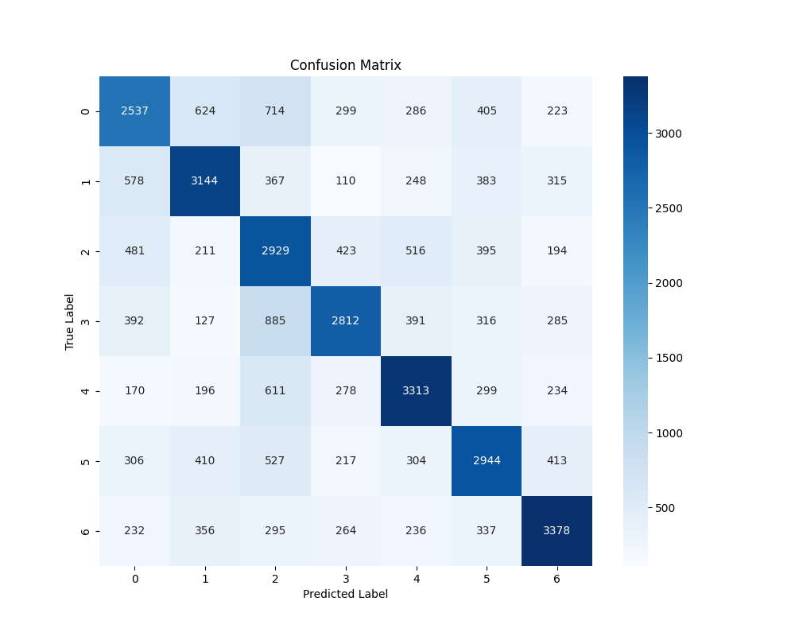

# VoxSent
## Description

This project implements an Emotion Analysis System that utilizes models trained on the GoEmotions dataset. The project includes two versions of emotion classification
- 28-Emotion Model: Predicts one of 28 emotions (with a neutral class included).
- 7-Emotion Model: Predicts one of 7 primary emotions (anger, disgust, neutral, surprise, joy, sadness, fear).

The trained models are integrated into a Streamlit-based web application that allows users to analyze emotions from text input and speech input (transcribed using Whisper).

## Dataset
The models are trained on the [GoEmotions Dataset on Kaggle](https://www.kaggle.com/datasets/shivamb/go-emotions-google-emotions-dataset), which is annotated with multiple emotions per text. Data preprocessing includes:
* Cleaning text
* Tokenization
* Padding sequences
* Data augmentation (for the 7-emotion model)

## Installation
```
# Create a new conda environment
conda create --name emo python=3.10
conda activate emo

# Install dependencies
pip install -r requirements.txt

# Install FFmpeg
conda install -c conda-forge ffmpeg

# Run the Streamlit app
streamlit run main.py
```

## Troubleshooting

**Problem**: Emotion classification is a challenging task, particularly when dealing with imbalanced datasets. The 28-emotion model suffers from data imbalance

**Solution**: Trained 7-emotion model with balanced data and augmentation.

## Usage
1. **Run the Streamlit app** to analyze emotions from text and speech.
2. **Upload an audio file or type text** to generate predictions.
3. **Select the emotion model** 28-emotion or 7-emotion.
4. **Receive detailed analysis** with predicted emotions and emoji-based visualization.
5. **Explore training insights** with confusion matrices and model evaluation reports in about me page.

## Model Architecture
### 28-Emotion Model

### 7-Emotion Model


## Results
### Training History
#### 28-Emotion Model

#### 7-Emotion Model


### Confusion Matrix
#### 28-Emotion Model

#### 7-Emotion Model


### Classification Report
#### 28-Emotion Model
| class        | precision | recall | f1-score | support |
|--------------|-----------|--------|----------|---------|
| 0            | 0.51      | 0.50   | 0.50     | 4146    |
| 1            | 0.51      | 0.72   | 0.60     | 1824    |
| 2            | 0.36      | 0.33   | 0.34     | 1596    |
| 3            | 0.21      | 0.03   | 0.06     | 2406    |
| 4            | 0.45      | 0.06   | 0.10     | 3005    |
| 5            | 0.30      | 0.11   | 0.16     | 980     |
| 6            | 0.33      | 0.07   | 0.12     | 1318    |
| 7            | 0.42      | 0.11   | 0.18     | 1541    |
| 8            | 0.44      | 0.18   | 0.26     | 606     |
| 9            | 0.23      | 0.02   | 0.04     | 1327    |
| 10           | 0.21      | 0.01   | 0.03     | 1797    |
| 11           | 0.22      | 0.22   | 0.22     | 690     |
| 12           | 0.00      | 0.00   | 0.00     | 345     |
| 13           | 0.45      | 0.07   | 0.11     | 866     |
| 14           | 0.45      | 0.33   | 0.38     | 483     |
| 15           | 0.65      | 0.72   | 0.68     | 1675    |
| 16           | 0.00      | 0.00   | 0.00     | 82      |
| 17           | 0.35      | 0.22   | 0.27     | 1046    |
| 18           | 0.47      | 0.68   | 0.55     | 1043    |
| 19           | 0.00      | 0.00   | 0.00     | 202     |
| 20           | 0.41      | 0.22   | 0.29     | 1036    |
| 21           | 0.00      | 0.00   | 0.00     | 155     |
| 22           | 0.00      | 0.00   | 0.00     | 1003    |
| 23           | 0.00      | 0.00   | 0.00     | 152     |
| 24           | 0.34      | 0.46   | 0.39     | 336     |
| 25           | 0.33      | 0.25   | 0.28     | 737     |
| 26           | 0.37      | 0.27   | 0.31     | 663     |
| 27           | 0.37      | 0.81   | 0.51     | 11185   |
| accuracy     |           |        | 0.40     | 42245   |
| macro avg    | 0.30      | 0.23   | 0.23     | 42245   |
| weighted avg | 0.37      | 0.40   | 0.33     | 42245   |


#### 7-Emotion Model
| class        | precision | recall | f1-score | support |
|--------------|-----------|--------|----------|---------|
| 0            | 0.54      | 0.50   | 0.52     | 5088    |
| 1            | 0.62      | 0.61   | 0.62     | 5145    |
| 2            | 0.46      | 0.57   | 0.51     | 5149    |
| 3            | 0.64      | 0.54   | 0.59     | 5208    |
| 4            | 0.63      | 0.65   | 0.64     | 5101    |
| 5            | 0.58      | 0.57   | 0.58     | 5121    |
| 6            | 0.67      | 0.66   | 0.67     | 5098    |
| accuracy     |           |        | 0.59     | 35910   |
| macro avg    | 0.59      | 0.59   | 0.59     | 35910   |
| weighted avg | 0.59      | 0.59   | 0.59     | 35910   |


### Web Application

